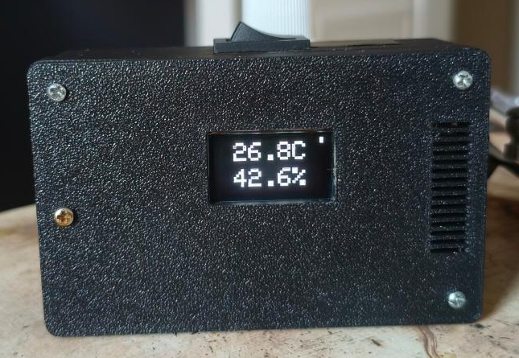
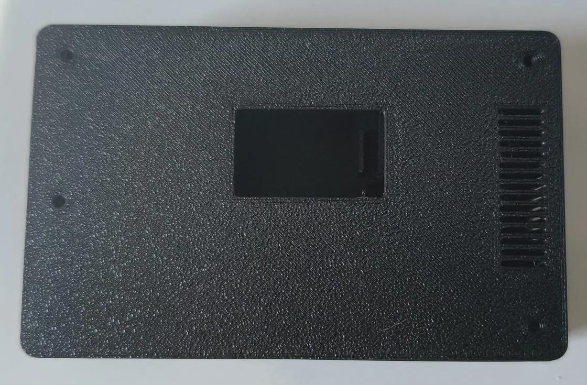
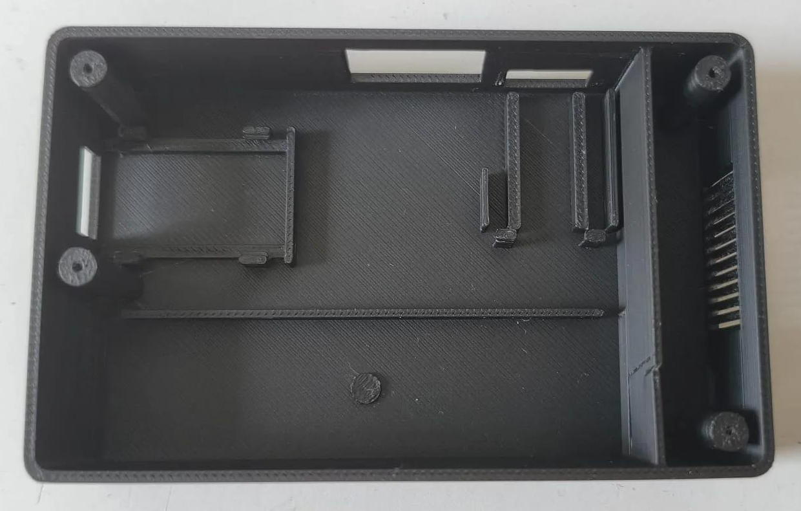
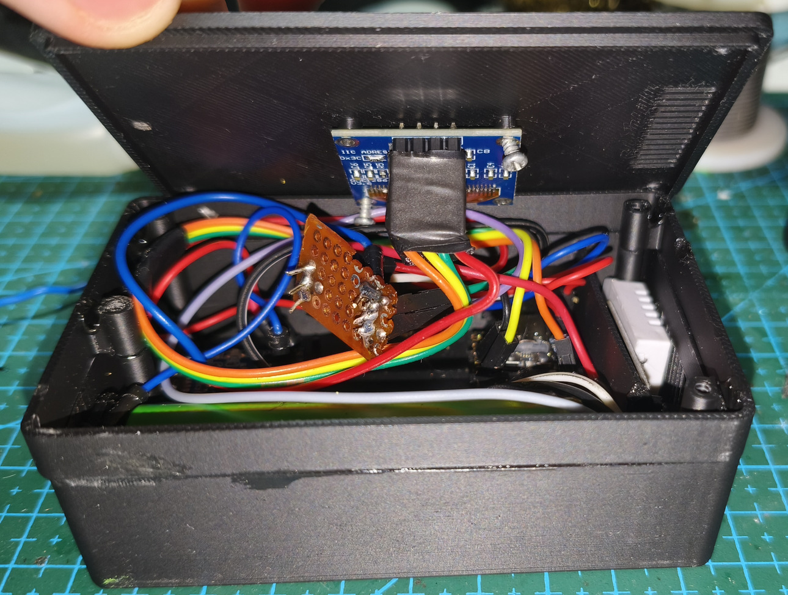
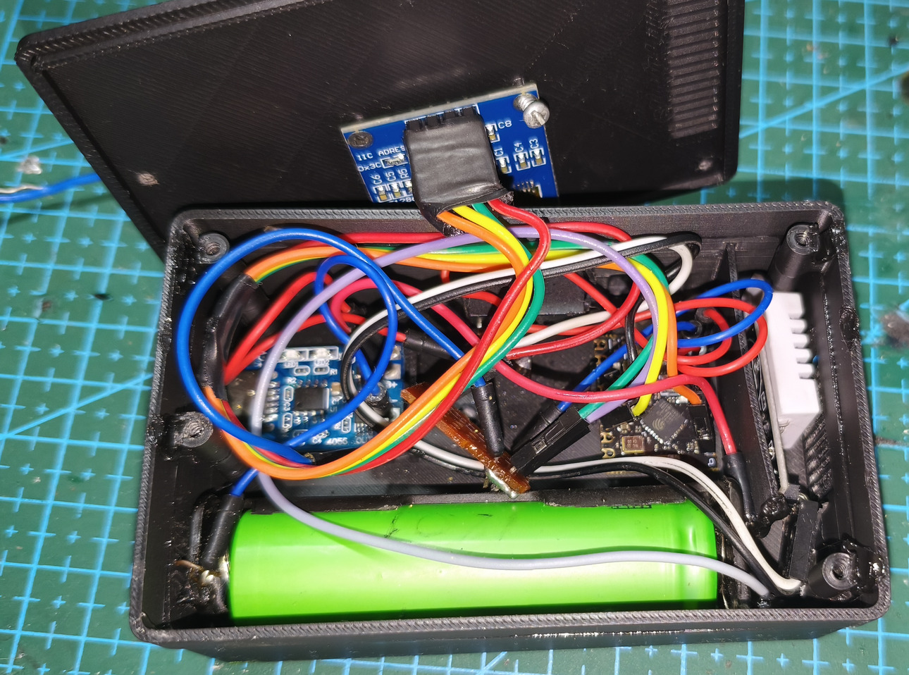

# RoomState — ESP32-C3 Temperature/Humidity Monitor

A compact, battery-powered ambient temperature and humidity monitor featuring an ESP32-C3 Super Mini, DHT22 sensor, and a 0.96" SSD1306 OLED display. The monitor is housed in a custom two-part 3D-printed enclosure; build photos are shown below.

When operating on battery power, the ESP32-C3 enters light sleep between three-second sensor update cycles, allowing the OLED to retain its display buffer while reducing CPU consumption. Light sleep automatically disengages whenever a USB serial host is connected so uploading, monitoring, and debugging continue normally.

- **Board:** ESP32-C3 Super Mini (native USB-Serial/JTAG, **no** USB-UART bridge chip)
- **Sensor:** DHT22 (isolated thermal chamber)
- **Display:** 0.96" 128x64 OLED, SSD1306, I2C, address `0x3C`
- **Power & Charging:** 18650 Li-ion cell + TP4056 (with DW01A/8205A protection circuit) + KCD1 rocker switch
- **Enclosure:** Custom 3D-printed two-part desk enclosure (Bambu Lab P2S, PLA)
- **Framework:** PlatformIO + Arduino framework, flashed via esptool

---

## Physical Build & Enclosure Photos

### 1. Assembled Monitor

The assembled black enclosure with the OLED displaying temperature and humidity, the rocker switch, and the ventilation grille.



### 2. Printed Lid

The lid before assembly, showing the OLED opening, ventilation slots, and screw holes.



### 3. Base Interior

The empty base, showing the internal mounting features, compartment divider, and ventilation openings.



### 4. Internal Electronics — Angled View

The open enclosure showing the wiring, perfboard, and the OLED module mounted behind the lid.



### 5. Internal Electronics — Overhead View

A closer overhead view of the 18650 cell, charging module, ESP32-C3, DHT22 sensor, and wiring.



---

## Pinout (Final, Verified)

| Component | ESP32-C3 Pin |
|---|---|
| DHT22 DATA | GPIO7 |
| OLED SDA | GPIO0 |
| OLED SCL | GPIO10 |
| OLED VCC / GND | **Directly from ESP 3.3V / GND** |
| DHT22 VCC / GND | **Directly from ESP 3.3V / GND** |

### Pins to Avoid

| Pin | Reason |
|---|---|
| GPIO2, GPIO8, GPIO9 | Strapping pins. If at an incorrect logic level during reset, the board will fail to boot. GPIO8 is also the onboard LED. |
| GPIO5 | Has internal board leakage on this module (behaves the same on a breadboard, internal to the ESP). |

---

## Critical Assembly Rule

> **Power modules directly from the ESP's 3.3V and GND pins, NOT from perfboard power rails.**

The longest troubleshooting session in this project stemmed from this. The display power was routed through perfboard tracks where the return ground path was inadequate. The multimeter read 3.29V at the VCC pad, yet the display was completely inoperable.

A voltmeter draws virtually no current — **it cannot detect a broken ground return path.** Voltage looks correct, yet the device is dead.

---

## Troubleshooting Guide

### Symptom → Cause Table

| Symptom | Meaning |
|---|---|
| `SDA` LOW, `SCL` clean HIGH | **Module is unpowered.** The line with a pull-up inside the module (DHT DATA, OLED SDA) gets pulled down to a dead VCC rail (~0.6V). SCL (without internal pull-up) stays clean HIGH via the ESP pull-up. This distinction is the most reliable clue. |
| Both lines LOW | Dead bus: wire shorted to GND, or a slave device is hung mid-transfer. |
| Lines clean HIGH, but no ACK | Signal is not reaching display (cold solder joint / broken wire), or SDA/SCL swapped. |
| Display freezes on last frame | ESP continues running but I2C writes fail. SSD1306 retains image in its internal GDDRAM. If the display had died completely, the screen would be blank. |
| `OLED init duration: 12003 ms` | 12 × 1000ms timeout. Bus completely dead. `display.begin()` still returns "true" — **it does not verify ACK**, do not trust its return value. |

### Software Pin Health Check

Drive the pin HIGH push-pull, then release it to internal pull-up (~45kΩ) only:

| Driven | Pull-up | Result |
|---|---|---|
| 1 | 1 | **Clean** |
| 1 | 0 | **Resistive leakage** (a few kΩ) — continuity buzzer stays silent, but pin fails to stay HIGH |
| 0 | 0 | **Hard short circuit** |

Timing is critical: after enabling pull-up, wait at least a few milliseconds. Sampling within microseconds reads LOW before the line has finished rising.

### Why Multimeters Can Mislead

- **Continuity buzzers only sound below ~50Ω.** A 6kΩ leakage pulls a logic pin LOW, but the buzzer stays silent. "No buzzer" does not mean no short.
- **Never perform continuity tests while powered.** Capacitors charging cause brief beeps, giving false positives.
- **TP4056 body diode.** Even when protection MOSFETs are off, current flows in one direction through the body diode (buzzer sounds) — yet there is no true operational ground path.
- **Voltmeters cannot see open grounds.** Correct voltage reads at VCC, but device still does not work.

### The TP4056 Grounding Trap

On protected TP4056 modules, MOSFETs sit **directly on the GND return path** (between B− and OUT−). **If no battery is connected, OUT− is disconnected.** If testing without a battery, do not establish common ground through the TP4056.

Proper wiring:
- TP4056 `B+` / `B−` → Battery
- TP4056 `OUT+` → ESP **5V** pin (never 3.3V pin — raw battery voltage reaches 4.2V)
- TP4056 `OUT−` → ESP GND
- Other modules' power → **ESP 3.3V / GND pins**, not TP4056

---

## Software Pitfalls

### 1. USB CDC Flags Are Required

The Super Mini lacks a dedicated USB-to-UART bridge chip. Without these flags, `Serial` outputs to physical UART0 pins (GPIO20/21) rather than the native USB port — you will not see a single line in terminal:

```ini
build_flags =
    -D ARDUINO_USB_MODE=1
    -D ARDUINO_USB_CDC_ON_BOOT=1
```

`ARDUINO_USB_CDC_ON_BOOT` defaults to 0. ESP32-C3 lacks full USB-OTG, only having USB-Serial/JTAG — correct mode is `ARDUINO_USB_MODE=1`.

### 2. `display.begin()` Does Not Verify ACK

It returns `true` even with no display connected, locking execution for ~12 seconds timing out on each command. Solution: verify device presence first via bit-bang probe before initializing.

### 3. Wire Peripheral Hangs on Faulty Bus

`Wire.setTimeOut()` does not cover every condition. If SCL cannot rise, `Wire.endTransmission()` can block indefinitely. Therefore:
- `Wire.begin()` is **never called** until the display is detected
- Device presence is verified via bit-bang I2C (deterministic timing, never blocks)

### 4. `Wire.end()` + `Wire.begin()` Loops Crash the Core

Do not call this pair repeatedly for periodic reconnection. Keep Wire uninitialized and use bit-bang probing instead.

### 5. Do Not Call `pinMode()` on I2C Pins While Wire Is Active

In arduino-esp32, this can break GPIO matrix routing and disconnect Wire entirely. Wire must be inactive during bit-bang operations.

### 6. 400 kHz Requires External Pull-ups

Adafruit_SSD1306 defaults bus speed to 400 kHz. Without external pull-ups, only the ESP's ~45kΩ internal pull-ups remain, and signal edges cannot rise fast enough. Reduce to 100 kHz:

```cpp
Adafruit_SSD1306 display(SCREEN_WIDTH, SCREEN_HEIGHT, &Wire, OLED_RESET, 100000UL, 100000UL);
```

Permanent solution: 4.7kΩ resistors from SDA and SCL to 3.3V. **However, if there is kΩ-range leakage on the line, even external pull-ups will not save it** — 6kΩ leakage with 4.7kΩ pull-up only reaches ~1.85V, well below the HIGH logic threshold.

### 7. Boot-time Serial Output Is Dropped

Data sent before the USB-CDC host connects is lost. Rather than printing diagnostics once in `setup()`, include recurring status lines inside `loop()`.

### 8. DTR/RTS When Connecting to Serial Port

- **DTR=1, RTS=0** → Normal read mode (HWCDC only sends output once host indicates connection)
- **DTR=1, RTS=1** → Board enters download mode and stays halted, producing no output

---

## Physical Assembly Notes

- Do not route signal and power through perfboard copper tracks. Run wires **directly to ESP pins**, using the perfboard purely as a mechanical carrier.
- Do not solder the ESP directly; **use pin headers** — if module replacement is needed, the entire board won't need rebuilding.
- **Use solid core wire.** A single stray strand from stranded wire reaching an adjacent pad is invisible, won't trigger continuity buzzers, yet causes a few kΩ of leakage.
- Clean after every solder operation with **isopropyl alcohol** (IPA, 90%+). Flux residue produces leakage in the exact kΩ range.
- **Avoid oxidant creams / hydrogen peroxide.** Creams leave conductive, hygroscopic films; peroxide oxidizes copper.
- Disconnect board power before swapping wires.
- Keep the ESP antenna keepout zone (opposite side of USB-C) clear of copper and wiring.

---

## Useful Commands

Find the device port with `pio device list`. Replace `COMx` below with your port (for example, `COM4` on Windows or `/dev/ttyACM0` on Linux). PlatformIO upload discovers the port automatically.

```bash
# Build and upload
pio run -t upload

# Reset chip (if stuck in download mode)
python -m esptool --port COMx --after hard-reset chip-id

# Full flash erase
python -m esptool --port COMx erase_flash
```

Reading serial output with PowerShell (more deterministic than `pio device monitor` — manual DTR/RTS control):

```powershell
$p = New-Object System.IO.Ports.SerialPort COMx,115200,None,8,one
$p.Open(); $p.DtrEnable=$true; $p.RtsEnable=$false
Start-Sleep -Milliseconds 5000
$p.ReadExisting(); $p.Close()
```

---

## Files

| Path | Description |
|---|---|
| `src/main.cpp` | Main firmware |
| `platformio.ini` | Board definition, USB CDC flags, libraries |
| `ENCLOSURE.md` | 3D-printed enclosure design and dimension specifications |
| `enclosure/` | 3D model exports (Base.stl, Lid.stl, STEP assemblies) |
